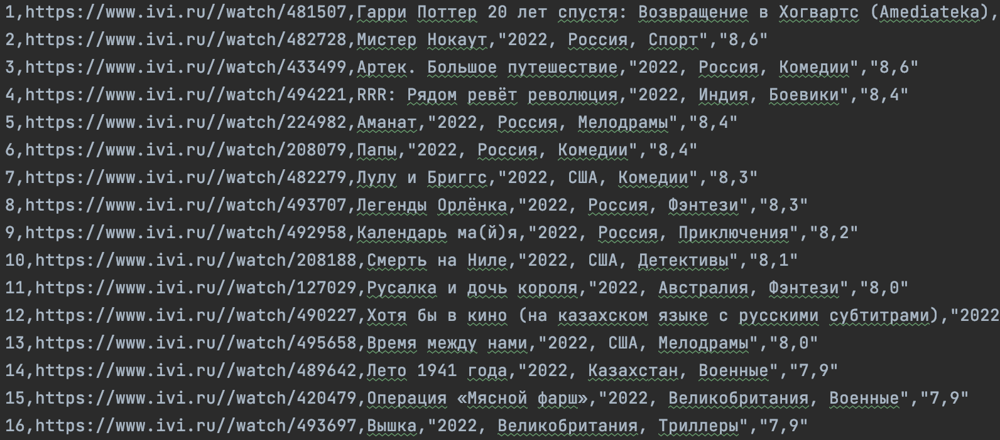

# HTML Парсер онлайн кинотеатра IVI

## Техническое задание

Разработать программу, которая успешно соберет названия фильмов, оценки, рейтинги, ссылки. С сайта - кинотеатра IVI.

## Результат работы

Программа успешно собирает данные с сайта и записывает в отдельный файл.

## Требования
- использовать BeautifulSoup
- использовать request
- ускорить процесс выбора фильма для просмотра
- все фильмы должны заносить в отдельный файл
- должен быть использован метод html

